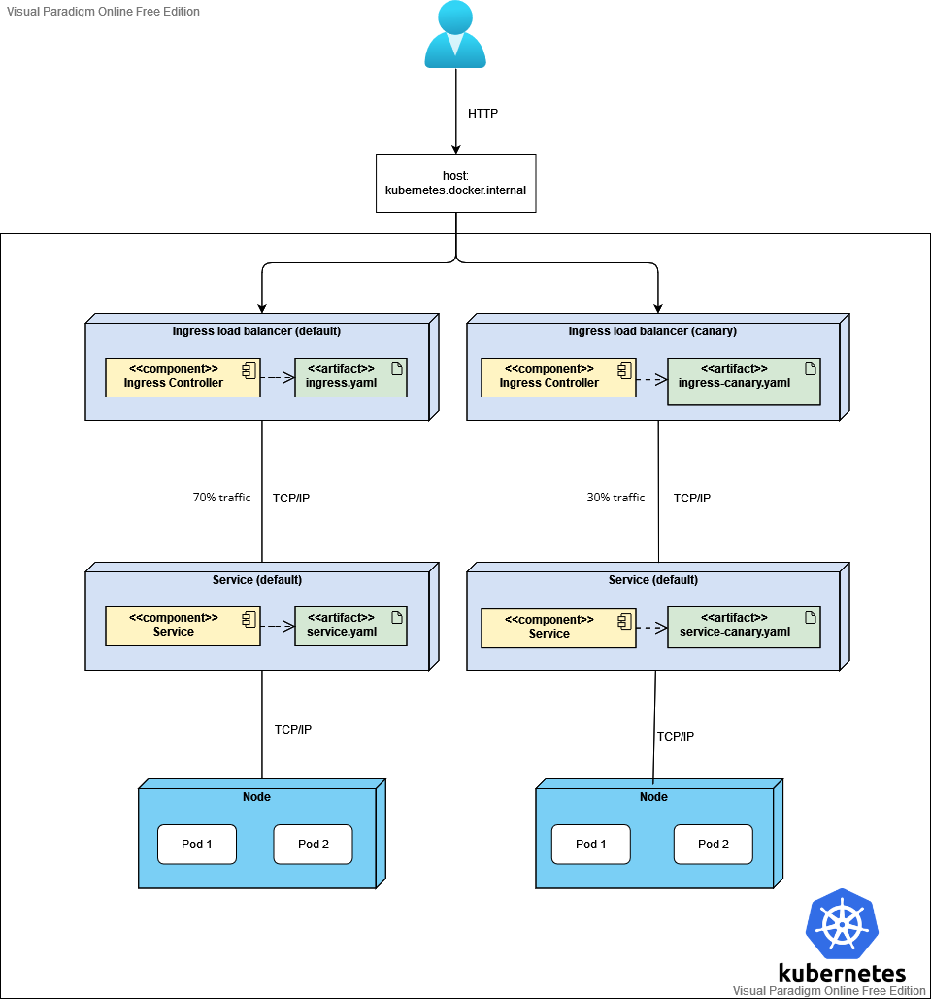

# Deploy simulation using Kubernetes to run locally

Demonstration to how to deploy an application with canary server in Kubernetes running locally for testing purposes with zero dependencies of cloud services.

## :point_down: Prerequisites before running the project
- #### [Having Docker and Kubernetes installed](https://docs.docker.com/get-docker/) (Note: Kubernetes is often installed along with Docker when you install it)
- #### [Helm download](https://github.com/helm/helm/releases) (Note: Helm helps you manage Kubernetes applications)

## :raising_hand: Initial step: Build the Docker images for the default server and the canary server

- To build the Docker images navigate locally within the directory where the file *Dockerfile* is located and run `docker image build defaultserverimage:1.0 .`
- Notice that the previous step created the image of the default server. Before running to create the canary server image, let's change the response of the project so you can notice the difference when requesting the default server and the canary server. Navigate to the *WeatherForecastController.cs* within the project and replace the string *"Default Server"* to *"Canary Server"*
- Within the *Dockerfile* directory again, run `docker image build canaryserverimage:1.0 .`

## :raising_hand: Final step: How to run it locally on Kubernetes (windows approach)

- `git clone https://github.com/HelenReis/canary-server-deployment`
- Open the *helm.exe* file downloaded on prerequisites on *CMD*
- Run `helm repo add ingress-nginx`
- Run `helm install my-ingresser ingress-nginx/ingress-nginx --namespace base`
- Run `kubectl get services -n base` to verify if the *nginx-controller* and *nginx-controller-admission* are both available
- Run `kubectl create namespace base` to create the namespace where the deployment resources will be placed
- Navigate to the *deployment* directory within the project on *CMD* and run `kubectl apply -f .` to apply all the resources that Kubernetes will use to run the application
- Navigate in your favorite browser to `kubernetes.docker.internal/weatherforecast` and have your application running on Kubernetes balancing the traffic with 30% on the canary server and 70% on the default server :blush:
- [You can look for more Kubernetes commands here and play with it locally](https://kubernetes.io/docs/reference/generated/kubectl/kubectl-commands) 

## :eyes: What's next
- It'll be built a pipeline file to automate the process

## :pencil2: UML deploy diagram

